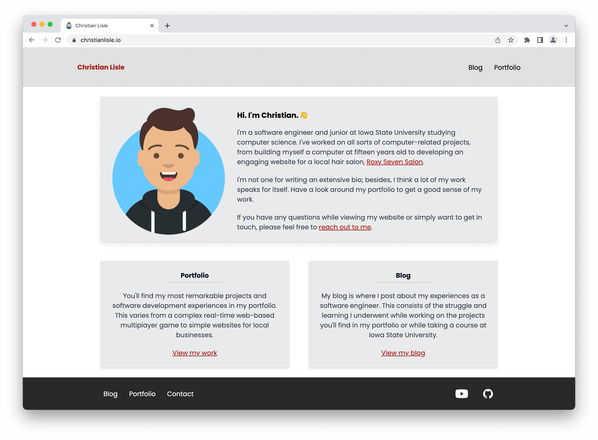
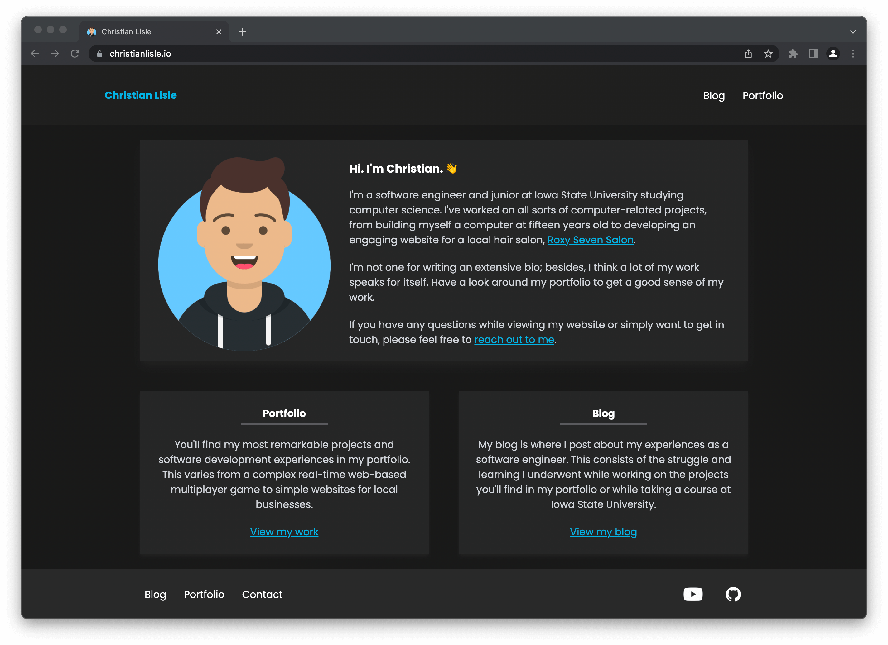

# [christianlisle.io](http://www.christianlisle.io)

Website for blogging and showcasing work. \
Built primarily with [NuxtJS](https://nuxtjs.org/) and [TailwindCSS](https://tailwindcss.com/).

<details open>

  <summary>Preview (light mode)</summary>

  [](http://www.christianlisle.io)
</details>

<details>

  <summary>Preview (dark mode)</summary>

  [](http://www.christianlisle.io)
</details>

<!-- Table of contents -->
### Table of contents
- [Make the site your own](#make-the-site-your-own-)
- [Running locally](#running-locally) 
  - [Environment setup](#environment-setup)
  - [Environment variables](#environment-variables)
  - [Run or generate the website](#run-or-generate-the-website)
  - [Testing](#testing-)

## Make the site your own 👨‍💻
This portfolio was built using a template repository. \
If you'd like a website similar to [mine](http://www.christianlisle.io), follow the instructions found on the [ChristianLisle/portfolio](https://github.com/ChristianLisle/portfolio) template repository.


## Running locally
### Environment setup
First, navigate to the project directory and ensure you're using the correct version of Node. Then, install the Node dependencies with [npm](https://www.npmjs.com/).
```bash
$ cd portfolio

# ensure node version is correct
$ nvm use

# install dependencies
$ npm install
```

### Environment variables
Copy the contents below into a file called `.env`  and fill in the values as needed.

```text[.env]
NUXT_ENV_SITE_URL=
NUXT_ENV_FULL_NAME=
NUXT_ENV_EMAIL_ADDRESS=
NUXT_ENV_SITE_NAME=
NUXT_ENV_GITHUB_PROFILE_URL=
NUXT_ENV_YOUTUBE_CHANNEL_URL=
```
<details>
  <summary>The purpose of each environment variable</summary>


  | Variable | Description | Required |
  | ----: | ------ | :--: |
  | `SITE_URL` | Utilized by the RSS feed generator to let readers know where they can find your site. | ✅ |
  | `FULL_NAME` | Utilized throughout the site in places like the introduction "Hi. I'm ___." and the NavBar's home page title.  | ✅ |
  | `EMAIL_ADDRESS` | Utilized for contact requests. | ✅ |
  | `SITE_NAME` | Utilized by the site to change the site title. If left blank, the `FULL_NAME` value is used. |  |
  | `GITHUB_PROFILE_URL` | When present, a link to GitHub is shown in the FooterBar. |  |
  | `YOUTUBE_CHANNEL_URL` | When present, a link to Youtube is shown in the FooterBar. |  |

  Note that each environment variable name is preceded by `NUXT_ENV_` so that it is easily accessible by the nuxt application. Refer to Nuxt's [Environment Variables documentation](https://nuxtjs.org/docs/configuration-glossary/configuration-env/#automatic-injection-of-environment-variables).
</details>

### Run or generate the website
Once you've installed the necessary Node modules and configured your environment variables, you can run the application. Run the application using the command that is most appropriate for your environment.

```bash
# serve with hot reload at localhost:3000 - ideal for development
$ npm run dev

# generate static site files
$ npm run generate

# serve the static site
$ npm run start
```


### Testing 🧪

Unit tests can be run with the [Jest](https://jestjs.io/) test runner. End-to-end tests are run with [Cypress](https://www.cypress.io/).

```bash
# run unit tests
$ npm run unit

# run e2e tests
$ npm run e2e

# run e2e in headless mode
$ npm run e2e:headless

# run e2e by connecting to an already-running server
$ npm run e2e:live
``` 
