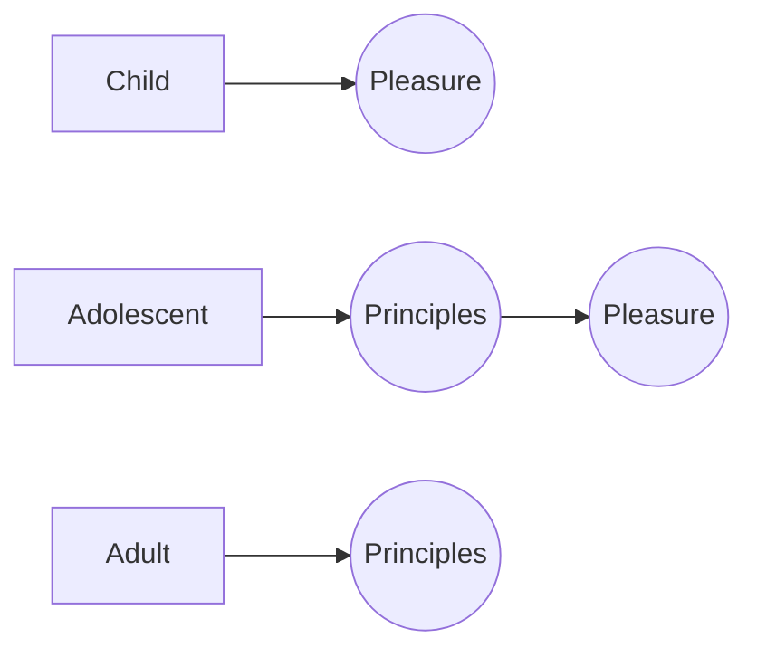

Immediately after reading *[The Subtle Art of Not Giving a F\*ck](/books/the-subtle-art-of-not-giving-a-fuck)* I picked up *Everything is F\*cked*. \
Unfortunately I must admit that this book does not hold the same *oomph* as its predecessor. However, that doesn't mean it's a bad read.

<!--more-->

In my post for *[The Subtle Art of Not Giving a F\*ck](/books/the-subtle-art-of-not-giving-a-fuck)*, I mentioned that I was subtly reminded of Daniel Kahneman's literature. Manson seriously surprises me in *Everything is F\*cked* where he directly quotes Kahneman's *[Thinking, Fast and Slow](/books/thinking-fast-and-slow)*. This is a pleasant surprise.

I must add that in Chapter 3, Manson talks about an "Emo Newton" character (an emotional Isaac Newton in a parallel universe). I understand what Manson is trying to do, but I find the entire chapter to be too elementary. Although, this rudimentary discussion may be perfect for naive philosophers.

Altogether, the book feels like a super brief overview into various philosophical topics. The book fails to dissect of any one specific topic in detail, but that might be what Manson aims to achieve.

### Who should read this book?
Anyone who is looking to dive in to philosophy, but doesn't know where to start.

**This is a must-read for:** Nobody. It is a good introduction to philosophy, though.

---

## Notes

### How to start a religion
Below are Manson's six steps to starting a religion (from chapter 4).
1. Sell Hope to the Hopeless
1. Choose your faith
1. Preemptively Invalidate All Criticism or Outside Questioning
1. Ritual Sacrifice (to some degree; think Communion)
1. Promise Heaven, deliver Hell
1. Prophet for Profit!

### Master Morality
The moral belief that people get what they deserve. The belief that if you earned something, you deserve it.

### Slave Morality
The belief that people who have suffered the most deserve the best treatment *because* of that suffering.

### Growing up
The diagram below encapsulates Manson's description of the different levels of maturity.

### Amor fati
The unconditional acceptance of all life and experience: the highs and the lows, the meaning and the meaninglessness.

| | Childhood | Adolescence | Adulthood |
| :-- | :-- | :-- | :-- |
| Values | Pleasure/pain | Rules and roles | Virtues |
| Sees relationships as... | Power Struggles | Performances | Vulnerability |
| Self-worth | Narcissistic: wide swings between "I'm the best" and "I'm the worst" | Other-dependent: externally validated | Independent: largely internally validated |
| Motivation | Self-aggrandizement | Self-acceptance | [*Amor fati*](#amor-fati) |
| Politics | Extremist/nihilist | Pragmatic, ideological | Pragmatic, nonideological |
| In order to grow, he/she needs... | Trustworthy institutions and dependable people | Courage to let go of outcomes and faith in unconditional acts | Consistent self-awareness |

---

## Quotes
### Emotion
> Emotion is the biological hydraulic system that pushes our bodies into movement.

> The overindulgence of emotion leads to a crises of hope, but so does the repression of emotion.

> Because when we lose our values, we grieve the death of those defining narratives as though we've lost a part of ourselves--because we *have* lost a part of ourselves.

### The "Clown Car"
> The Clown Car invariably drives toward addiction, narcissism, and compulsion. People whose minds are Clown Cars are easily manipulated by whatever person or group makes them feel good consistently--whether it is a religious leader, politician, self-help guru, or sinister internet forum.

> Some Clown Cars merely drive toward fun--they're all about drinking and fucking and partying. Others drive toward power. These are the most dangerous Clown Cars, as their Thinking Brains set to work justifying their abuse and subjugation of others through intellectual-sounding theories about economics, politics, race, genetics, gender, biology, history, and so on. A Clown Car will sometimes pursue hate, too, because hate brings its own odd satisfaction and self-assurance. Such a mind is prone to self-righteous anger, as having an external target reassures it of its own moral superiority. Inevitably, it drives toward the destruction of others because it is only through the destruction and subjugation of the outer world that its endless inner impulses can be satisfied.

### Self Control
> It's only in a group environment that the individual has no control, that he gains the perception of perfect self-control.

### Religion
> Each religion is a faith-based attempt to explain reality in such a way that it gives people a steady stream of hope.

> Science is arguably the most effective religion because it is the first religion that is able to evolve and improve upon itself. It is open to anybody and everybody. It is not moored to a single book or creed. It is not beholden to some ancient land or people. It is not tethered to a supernatural spirit whose existence cannot be proven or disproven. It is an ongoing, ever-changing body of evidence-based beliefs, one that is free to mutate, grow, and shift as the evidence dictates.

> The scientific revolution eroded the dominance of spiritual religions and made way for the dominance of ideological religions.

### Hope
> Hope depends on the rejection *of what currently is*.

### Meditation
> Most people avoid meditation the same way a kid avoids doing homework. It's because they know what meditation really is: it's confronting your pain.

### Adversity
> Protecting people from problems or adversity doesn't make them happier or more secure; it makes them more easily insecure.

> Pain is the source of all value. To numb ourselves to our pain is to numb ourselves to anything that matters in the world. Pain opens up the moral gaps that eventually become our most deeply held values and beliefs.
> When we deny ourselves the ability to feel pain for a purpose, we deny ourselves the ability to feel any purpose in our life at all.

### The internet
> Then, the internet happened.
> The internet is a bona fide innovation. All else being equal, it fundamentally makes our lives better. Much better.
> The problem is... well, the problem is *us*.
> The internet's intentions were good: inventors and technologists in Silicon Valley and elsewhere had high hopes for a digital planet. They worked for decades toward a vision of seamlessly networking the world's people and information. They believed that the internet would liberate people, removing gatekeepers and hierarchies and giving everyone equal access to the same information and the same opportunities to express themselves. They believed that if everyone were given a voice and a simple, effective means of sharing that voice, the world would be a better, freer place.
> A near-utopian level of optimism developed throughout the 1990s and 2000s. Technologists envisioned a highly educated global population that would tap into the infinite wisdom available at its fingertips. They saw the opportunity to engender greater empathy and understanding across nations, ethnicities, and lifestyles. They dreamed of a unified and connected global movement with a single shared interest in peace and prosperity.
> But they forgot.
> They were so caught up in their religious dreams and personal hopes that they forgot.
> They forgot that the world doesn't run on information.
> People don't make decisions based on truth or facts. They don't spend their money based on data. They don't connect with each other because of some higher philosophical truth.
> The world runs on *feelings*.
> And when you give the average person an infinite reservoir of human wisdom, they will not google for the information that contradicts their deepest held beliefs. They will not google for what is true yet unpleasant.
> Instead, most of us will google for what is pleasant but untrue.
> Having an errant racist thought? Well, there's a whole forum of racists two clicks away, with a lot of convincing-sounding arguments as to why you shouldn't be ashamed to have such leanings.
> The wife leaves you and you start thinking women are inherently selfish and evil? Doesn't take much of a Google search to find justifications for those misogynistic feelings. Think Muslims are going to stalk from school to school, murdering your children? I'm sure there's a conspiracy theory somewhere out there that's already "proving" that.
> Instead of stemming the free expression of our worst feelings and darkest inclinations, the start-ups and corporations dove right in to cash in on it. Thus, the greatest innovation of our lifetime has slowly transformed into our greatest diversion.

> Today's tyranny is achieved by flooding people with so much diversion, so much bullshit information and frivolous distraction, that they are unable to make smart commitments.

### Miscellaneous
> Let's face it, when Joseph Stalin is lecturing you about ethics and human decency, you know you've fucked up.

> The problem isn't that we don't know how *not* to get punched in the face. The problem is that, at some point, likely a long time ago, we got punched in the face, and instead of punching back, we decided we deserved it.

> While pain is inevitable, suffering is always a choice... There is always a separation between what we experience and how we interpret that experience.
